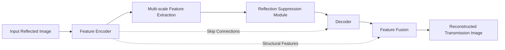

# GlassClear: Automated Glare & Reflection Elimination For Architectural Photography

GlassClear is a full-stack deep learning system for single-image reflection removal, restoration, and result management. The project integrates an RDNet-based inference pipeline with a Svelte frontend and a FastAPI backend to deliver an end-to-end platform for uploading images, suppressing reflections, preserving structural details, and exporting enhanced results.

## Abstract

Reflection artifacts caused by glass surfaces, windows, and high-intensity illumination often degrade scene visibility and reduce the usefulness of architectural and real-estate imagery. Manual correction is labor-intensive and can introduce visual artifacts or detail loss. GlassClear addresses this problem through an IEEE-style system design that combines image validation, reflection candidate analysis, deep neural restoration, post-processing, and workflow-oriented result management. The platform supports single-image processing, batch jobs, edit versioning, dashboard history, project organization, shareable outputs, and AI-assisted interactions, thereby extending reflection removal from a model demo into a practical restoration ecosystem.

## Keywords

Reflection Removal, Image Restoration, Deep Learning, RDNet, FastAPI, SvelteKit, Computer Vision, Architectural Imaging

## 1. Introduction

Images captured through or around reflective surfaces frequently contain glare, ghosting, and reflected foreground content that obscure the underlying scene. This issue is especially visible in architectural photography, interior documentation, storefront imaging, and real-estate media production. Traditional editing workflows demand expertise and substantial manual effort. GlassClear was developed to provide an intelligent and user-friendly framework that automates reflection suppression while preserving edges, textures, and scene realism.

## 2. Objectives

- To build a deep learning-based reflection removal pipeline for single-image restoration.
- To preserve meaningful architectural details such as facade edges, window boundaries, and texture continuity.
- To provide a modern web application for upload, processing, comparison, download, and history tracking.
- To support workflow features such as authentication, projects, collections, editor versioning, sharing, and batch processing.
- To present interpretable outputs through intermediate stages and confidence maps.

## 3. System Overview

GlassClear follows a layered architecture:

- Frontend Layer: Built using SvelteKit and Svelte 5 for upload, dashboard, chatbot, comparison view, and editor workflows.
- Backend Layer: Built using FastAPI for API orchestration, authentication, persistence, export, sharing, and job management.
- Inference Layer: Uses an RDNet-based model pipeline for reflection suppression, stage generation, and confidence estimation.
- Data Layer: Stores prediction metadata, users, projects, versions, collections, share links, delivery packs, and batch jobs.

## 4. Proposed Architecture

The proposed reflection-removal pipeline follows an encoder-decoder design with intermediate multi-scale feature learning and dedicated reflection suppression. Skip connections are employed to preserve structural information and improve reconstruction quality in the final transmission image.



Architecture interpretation:

- Feature Encoder: Extracts hierarchical image representations from the reflected input.
- Multi-scale Feature Extraction: Captures reflection patterns and scene structures at multiple receptive fields.
- Reflection Suppression Module: Separates or attenuates reflective interference from transmission content.
- Decoder and Feature Fusion: Reconstruct the reflection-free output while preserving edges, textures, and visual consistency.

## 5. Core Features

- Single-image reflection removal
- Reflection candidate validation before expensive inference
- Confidence-map generation for interpretability
- Progressive intermediate restoration stages
- Clean and enhanced output modes
- Dashboard history and smart album organization
- Editor workflow with version activation
- Batch processing with ZIP export
- Share links and delivery-pack support
- AI chatbot and AI-generated story/insight features

## 6. Technology Stack

### Frontend

- SvelteKit
- Svelte 5
- Vite
- Bootstrap
- Bootstrap Icons

### Backend

- FastAPI
- Uvicorn
- SQLAlchemy
- Pydantic / Pydantic Settings

### AI and Image Processing

- PyTorch
- Torchvision
- OpenCV
- Pillow
- NumPy

### Integrations

- Google Gemini API for conversational and assistive AI features

## 7. Methodology

The operational workflow of GlassClear is summarized as follows:

1. The user uploads an input image through the frontend interface.
2. The backend validates file integrity and checks whether the image is a meaningful reflection candidate.
3. The RDNet inference engine processes the image and produces:
   - final restored output
   - confidence map
   - intermediate restoration stages
4. Optional post-processing improves clarity and export readiness.
5. Restoration metadata, output references, and workflow records are stored in the database.
6. The frontend presents before/after results, download actions, project organization, and further editing tools.

## 8. Repository Structure

```text
ReflectionRemoval/
|-- backend/
|   |-- app/
|   |   |-- api/
|   |   |-- core/
|   |   |-- models/
|   |   |-- schemas/
|   |   |-- services/
|   |   |-- utils/
|   |   |-- main.py
|   |   `-- rdnet_infer.py
|   |-- tests/
|   `-- requirements.txt
|-- reflection-removal-frontend/
|   |-- src/
|   |   |-- lib/
|   |   `-- routes/
|   `-- package.json
|-- xreflection/
|   |-- models/
|   |-- losses/
|   |-- data/
|   `-- metrics/
|-- options/
|-- experiments/
`-- README.md
```

## 9. Setup

### Backend

```bash
cd backend
pip install -r requirements.txt
uvicorn app.main:app --reload
```

### Frontend

```bash
cd reflection-removal-frontend
npm install
npm run dev
```

## 10. Model Weights

Large model files such as `.pth` and `.ckpt` are intentionally excluded from Git tracking due to repository size constraints. In this project, the trained checkpoint is hosted externally and must be downloaded separately before running the full inference pipeline.

Checkpoint details:

- Filename: `psnr=38.2008.ckpt`
- Purpose: Trained RDNet checkpoint for reflection removal inference
- Destination path: `backend/app/experiments/train_sirs_rdnet/checkpoints/`

Google Drive download:

```text
Download `psnr=38.2008.ckpt` from: https://drive.google.com/file/d/1npnPC1iXmaLTDgSrqob0a4e9JmPSo70C/view?usp=sharing
Place it inside: backend/app/experiments/train_sirs_rdnet/checkpoints/
```

Steps to use:

- Open the shared Google Drive link
- Download `psnr=38.2008.ckpt`
- Copy the file into `backend/app/experiments/train_sirs_rdnet/checkpoints/`
- Ensure the filename remains exactly `psnr=38.2008.ckpt`

## 11. Results and Practical Outcome

GlassClear demonstrates that deep reflection removal can be packaged as a usable software platform rather than a standalone research artifact. The project produces restored outputs, interpretable confidence maps, organized user workflows, and export-ready results suitable for academic demonstration as well as practical image restoration scenarios.

## 12. Future Enhancements

- Real-time inference optimization
- Mobile and cloud deployment
- Video reflection removal
- Stronger quantitative benchmarking
- Region-aware selective editing
- Integrated super-resolution and artifact correction

## 13. Conclusion

GlassClear presents a complete full-stack framework for AI-driven reflection removal and image restoration. By combining deep learning inference with structured API services and an interactive frontend, the system provides both technical depth and practical usability. The project is suitable for final-year demonstrations, research-oriented presentations, and continued extension into production-grade restoration workflows.
